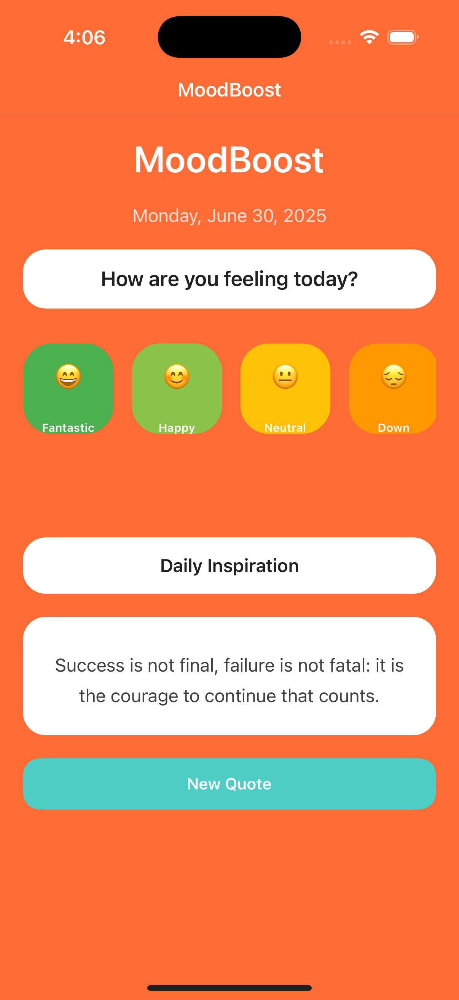

# MoodBoost - Daily Mood Tracker & Motivational App

A fun, polished .NET MAUI application that helps users track their daily mood and provides motivational quotes for inspiration. 

This app was created using [Amazon Q Developer CLI](https://docs.aws.amazon.com/amazonq/latest/qdeveloper-ug/command-line.html?trk=26a307dd-f6c6-4133-a99f-0388d1304aef&sc_channel=el).



## Features

- **Daily Mood Tracking**: Select from 5 different mood states with colorful emoji representations
- **Motivational Quotes**: Get inspired with randomly generated motivational quotes
- **Professional UI**: Clean, modern design with smooth interactions using Grid layouts and Border controls
- **Cross-Platform**: Runs on Android and iOS devices

## Technical Stack

- **.NET 9.0** - Latest .NET framework
- **.NET MAUI** - Cross-platform UI framework
- **CommunityToolkit.Mvvm 8.4.0** - MVVM pattern implementation with partial properties
- **CommunityToolkit.Maui 12.0.0** - Additional MAUI controls and helpers
- **MVVM Architecture** - Clean separation of concerns
- **Modern C# Features** - Collection expressions, partial properties, DateTimeOffset, Random.Shared

## Architecture

The app follows MVVM (Model-View-ViewModel) architecture with StyleCop SA1201 compliance:

- **Models**: `MoodEntry` record and `MoodData` static class with immutable collections using IReadOnlyList
- **ViewModels**: `MainPageViewModel` with partial observable properties and relay commands
- **Views**: `MainPage` with professional UI using only Grid layouts (no nested StackLayouts)

## Code Quality Features

- **StyleCop SA1201 Compliance** - Proper element ordering (constructors, properties, methods)
- **Collection Expressions** - Modern C# syntax `[...]` for collection initialization
- **Partial Properties** - Latest CommunityToolkit.Mvvm 8.4.0 features
- **Immutable Models** - Using records and IReadOnlyList for data safety
- **DateTimeOffset** - Proper date/time handling instead of DateTime
- **Random.Shared** - Efficient random number generation
- **Border Controls** - Modern UI using Border instead of Frame
- **Grid-Only Layouts** - No nested StackLayouts, pure Grid with RowDefinitions/ColumnDefinitions

## Build Requirements

- Visual Studio 2022 (latest version)
- .NET 9.0 SDK
- Android SDK (for Android deployment)
- Xcode (for iOS deployment on macOS)

## Build Instructions

1. Open the solution in Visual Studio 2022
2. Restore NuGet packages
3. Select your target platform (Android/iOS)
4. Build and deploy to device or emulator

## Project Structure

```
MoodBoost/
├── Models/
│   └── MoodEntry.cs              # Data models and static data with collection expressions
├── ViewModels/
│   └── MainPageViewModel.cs      # MVVM view model with partial properties
├── Views/
│   └── MainPage.xaml(.cs)        # Main UI page with Grid-only layout
├── Resources/
│   ├── Styles/
│   │   ├── Colors.xaml           # App color palette
│   │   └── Styles.xaml           # UI styles and themes
│   ├── Fonts/                    # Custom fonts
│   ├── AppIcon/                  # App icons (SVG)
│   └── Splash/                   # Splash screen
├── Platforms/
│   ├── Android/                  # Android-specific files
│   │   ├── MainActivity.cs
│   │   ├── MainApplication.cs
│   │   ├── AndroidManifest.xml
│   │   └── Resources/            # Android resources
│   └── iOS/                      # iOS-specific files
│       ├── AppDelegate.cs
│       ├── Program.cs
│       ├── Info.plist
│       └── LaunchScreen.storyboard
├── App.xaml(.cs)                 # Application entry point
├── AppShell.xaml(.cs)            # Shell navigation
├── MauiProgram.cs                # MAUI app configuration
└── MoodBoost.csproj              # Project file with .NET 9 and latest packages
```

## UI Design Philosophy

The app features a vibrant, professional design with:
- **Primary Color**: Orange (#FF6B35) for energy and positivity
- **Secondary Color**: Teal (#4ECDC4) for balance and calm
- **Clean Design**: White cards with rounded corners using Border controls
- **Modern Typography**: OpenSans font family
- **Responsive Layout**: Pure Grid system without nested layouts
- **Visual Hierarchy**: Proper spacing and color contrast

## Mood States

1. **Fantastic** 😄 - Green (#4CAF50) - "I'm feeling amazing today!"
2. **Happy** 😊 - Light Green (#8BC34A) - "Things are going well!"
3. **Neutral** 😐 - Yellow (#FFC107) - "Just an ordinary day"
4. **Down** 😔 - Orange (#FF9800) - "Not my best day"
5. **Sad** 😢 - Red (#F44336) - "Feeling quite low today"

Each mood includes an emoji, name, description, and associated color for immediate visual feedback.

## Development Best Practices

- **Immutable Data**: All collections use IReadOnlyList and collection expressions
- **Type Safety**: Nullable reference types enabled
- **Modern Patterns**: Latest C# language features and MVVM toolkit
- **Platform Integration**: Proper Android and iOS platform-specific implementations
- **Performance**: Efficient UI rendering with Grid-only layouts
- **Maintainability**: Clean architecture with clear separation of concerns

## Getting Started

1. Clone the repository
2. Open `MoodBoost.sln` in Visual Studio 2022
3. Ensure .NET 9.0 SDK is installed
4. Select your target platform (Android/iOS)
5. Build and run the application

The app will launch with today's date displayed and allow you to select your current mood, view motivational quotes, and track your daily emotional state with a beautiful, professional interface.
