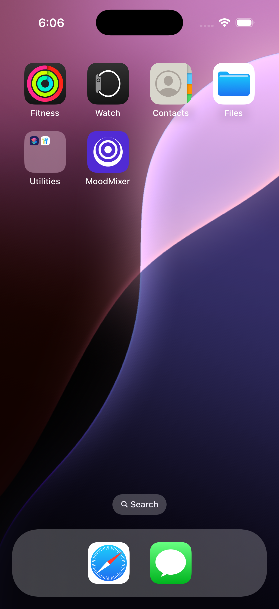

## Hey Q! Make Me A Cool Mobile App

Welcome to the **Hey Q!** blog series where we build fun apps using [Amazon Q Developer](https://docs.aws.amazon.com/amazonq/latest/qdeveloper-ug/command-line.html?trk=26a307dd-f6c6-4133-a99f-0388d1304aef&sc_channel=el) and learn about the code along the way! The scope of the sample apps created in this series are small 1-2 page applications that are fun, well designed and properly architected following best practices. And, the best part, the code is all open-source allowing you to grab it and use it for your apps! Here's the link to the completed open-source project: https://github.com/thecodetraveler/moodmixer

**Note:** Responses from LLMs are non-deterministic which can result in different outputs despite asking the same question. You may receive slightly different responses from Q Developer when trying to replicate the same steps below.

This week we are building a Mobile App for iOS + Android in C# using .NET MAUI. For this app, I have a few goals:
1. The app must compile and run on a mobile device
2. The app must have a nice, highly polished, professional User Interface (UI)
3. The app must have a fun name that relates to its use
4. The code must created by first using the latest version of the .NET MAUI template in the latest version of Visual Studio
5. The code must use the MVVM Architecture
6. The code must follow best practices 
7. The code must use the most-recent versions for all dependencies

### Creating the App

Let's get started! I've [already installed Q Developer CLI](https://docs.aws.amazon.com/amazonq/latest/qdeveloper-ug/command-line-installing.html?trk=26a307dd-f6c6-4133-a99f-0388d1304aef&sc_channel=el) on my Mac, so let's begin by opening the [macOS Terminal](https://support.apple.com/guide/terminal/welcome/mac) and begin chatting with Q using the following command

Next, I will help Q out a bit by giving Q a profile. This reduces the scope of the datasets that Q will reference helps Q better understand the problem we are trying to solve together.

Now let's ask it to build us an app and see what happens! 

It looks like the it is starting with the `CSPROJ` file; not a bad place to begin! However, it still using older .NET Frameworkds (`net8.0`) and older NuGet Packages. Let's ask it to use the latest versions.

Much better! Let's enter `y` to accept this `CSPROJ` and continue. Approved ✅ 

Ok, easy, it wants to create a `Views` folder and a `ViewModels`. Approved ✅ 

Next, it created our Model class. I asked it to use a `record` so that our model would be immutable. Approved ✅ 

Next it created our View Model class. It's great to see it using the MVVM Architecture with `CommunityToolit.Mvvm`, however, I'd like it to use properties instead of fields for all `[ObservableProperty]`. Let's ask it to fix this for us. 

Much better! Approved ✅ 

Next it created the View in XAML. It's great to see it using one `Grid` layout instead of, for example, nesting a `HorizontalStackLayout` inside of a `VerticalStackLayout` which would've caused poor performance on older mobile devices. Approved ✅ 

Next, it created the code-behind file for the XAML file created in the previous step. This looks good! Approved ✅

Now it has created our `MauiProgram.cs`, the starting point for all .NET MAUI apps. Approved ✅

It has now created the `App.xaml` file and the `App.xaml.cs` files. Approved ✅

Next, it has created for us `AppShell.xaml` and `AppShell.xaml.cs`, following best practices using Shell for Navigation. Approved ✅

Holy cow! It has gone back and updated our View layer, `MainPage`, to use Dependency Injection. This is a great refactor. Approved ✅

And now it has even created a README for us. Nice touch! Approved ✅

Now it is creating the folder structure for our `Resources`. Approved ✅

It has now created all of the Android-specific files we need in order to run our app on Android and placed them in `/Platforms/Android`. Approved ✅

Not suprisingly, it next created all of the iOS-specific files we need to run on iOS and placed them in `/Platforms/iOS`. Approved ✅

Not suprisingly, third, it created all of the MacCatalyst-specific files that we need to run on macOS and placed them in `/Platforms/MacCatalyst`. Approved ✅

And lastly, it has created all of the Windows-specific files that we need to run on Windows and placed them in `/Platforms/Windows`. Approved ✅

And finally, it has created all of the Fonts, Colors and Styles, including the Icons and SplashScreens as `svg` files, and placed them correctly in the `Resources` folder. Approved ✅

Now it's time to deploy it to a mobile device. Holy cow! Look at the App Icon it created! I love it!! 

Now let's run the app! And, wow wow wow, it looks very good!
